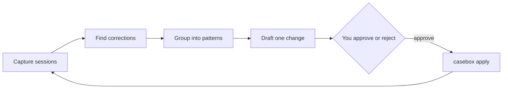

# Casebox

**Stop steering your coding agents.**

Casebox finds the corrections you keep making to your coding agents, and proposes small changes to your repository that prevent them: an instruction, a skill, an MCP server, or a code note for your agent. You approve or reject each one. Casebox never becomes your harness.

<p>
  
  
</p>

## Quickstart

You need Docker and git. Install the CLI, start a local server, and import your history:

```bash
curl -fsSL https://casebox-docs.pages.dev/install.sh | sh
casebox up        # the server, QueueBox and Postgres in Docker; prints the admin password
casebox init      # in your repository: log in, choose the prompt mode
casebox import --days 90
```

A worker with an analysis model classifies your corrections and drafts proposals. It uses an OpenAI-compatible or Anthropic key, or your Cursor CLI login. To see every page with a synthetic team first, run `casebox up --demo`. The [first tutorial](https://casebox-docs.pages.dev/tutorials/first-steering-report/) continues from here.

## What you get

- **The steering report.** How often people correct their agents, on which work items, and what prevents each correction next time.
- **Patterns.** Corrections that share a cause, with the quotes behind them.
- **Proposals you approve.** For each pattern, one small change, with the corrections it targets and a diff. At most three wait at once. A rejection keeps the change away for 90 days.
- **Private until you share.** `casebox apply` writes an approved change as a file only your machine has, so you gather evidence before you ask your team. `--commit` shares it. 30 days later, Casebox shows whether the corrections fell.

## How it works



Hooks and the session logs on each machine feed the server. GitHub and Jira add pull requests, reviews, reverts and work items. Workers run the analysis model and hold its key. The server writes nothing to a git host: a change lands through `casebox apply` on your machine, and you commit it as usual.

## How Casebox differs

| Tool | What it does | What Casebox adds |
| --- | --- | --- |
| Agent memory (Hermes, memory MCPs) | The agent rewrites its own memory | Changes go into your repository's own files, one small reviewed change at a time. Nothing sits between you and your agent. |
| [Entire](https://github.com/entireio/cli) | Captures agent sessions next to commits | Reads Entire checkpoints as input. Adds steering, patterns and proposals. |
| Faros, DX, Jellyfish | Organisation-level adoption dashboards | Concrete changes that prevent specific corrections. No per-person view. |

Casebox is not a coding agent, a code review tool or a CI system.

## Supported

- **Agents:** Claude Code, Codex and the Cursor CLI.
- **Analysis models:** any OpenAI-compatible API, Anthropic, or the Cursor CLI's own login.
- **Work items:** Jira Data Center and GitHub Issues.
- **Code hosts:** GitHub, through a GitHub App or a fine-grained token.

## Privacy

Casebox measures the harness, never the person. There are no per-person views, ever.

- The CLI redacts secrets and marks identities before anything leaves a machine. The server replaces each identity with a pseudonymous token in memory, before it writes anything.
- The prompt mode decides what leaves each machine: `off` (no prompt text), `redacted` (prompts with secrets and identities removed) or `full`.
- A theme, quote or count shows only when at least 3 people are behind it. While you are the only person, you see your own data in full.
- `casebox erase --identity` removes a person's data. `casebox uninstall` removes Casebox's hooks from your agents.

[The privacy model and its limits](https://casebox-docs.pages.dev/concepts/privacy/) lists what Casebox does not protect against.

## Links

- [Documentation](https://casebox-docs.pages.dev), also as [llms.txt](https://casebox-docs.pages.dev/llms.txt) for coding agents.
- Licences: the CLI is Apache 2.0. The server and the web UI are AGPL 3.0. See [LICENSE](LICENSE).
- [Contributing](CONTRIBUTING.md). Contributions need the [CLA](CLA.md).
