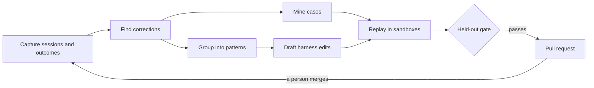

# Casebox

**Stop steering your coding agents.**

Casebox measures how often your team must correct its coding agents, and why. It turns that history into replayable cases, and it tests every harness change on those cases before a person merges it.

<p>
  
  
</p>

## Quickstart

You need Docker and git. Install the CLI, start a local server, and import a month of sessions:

```bash
go install github.com/alternayte/casebox/cli/cmd/casebox@latest
casebox up        # the server, QueueBox and Postgres in Docker; prints the admin password
casebox init      # in your repository: log in, choose the prompt mode, connect GitHub and Jira
casebox import --days 30
```

To see every page with a synthetic team first, run `casebox up --demo`. The [first tutorial](https://casebox-docs.pages.dev/tutorials/first-steering-report/) continues from here.

## What you get

- **The steering report.** How often people correct their agents, on which work items, and what prevents each correction next time: a harness rule, a clearer ticket or a stronger model.
- **Cases from your own history.** Merged pull requests, reverts and corrected sessions become replayable tasks. The pull request's own tests decide each case.
- **Measured comparisons.** A model, agent or harness change runs on your cases. The result is better, worse, equivalent or inconclusive, always with the sample size and the interval.
- **Proposals as pull requests.** Recurring corrections become small harness edits. Each edit passes a held-out gate before it opens a pull request, and a person merges it.

## How it works



Hooks and the session logs on each machine feed the server. GitHub and Jira add the pull requests, reviews, reverts and work items. Workers replay cases in sandboxes (Docker, Kiln or Daytona) and hold the model keys. The server never runs case code. [How verdicts work](https://casebox-docs.pages.dev/concepts/verdicts/) explains the statistics in plain words.

## How Casebox differs

| Tool | What it does | What Casebox adds |
| --- | --- | --- |
| [Entire](https://github.com/entireio/cli) | Captures agent sessions next to commits | Reads Entire checkpoints as input. Adds steering, cases, verdicts and proposals. |
| [RepoBench](https://pypi.org/project/repobench/), [CodeProbe](https://pypi.org/project/codeprobe/) | One-shot local benchmarks from merged pull requests | Cases from failures and corrections too, a team server, harness CI and proposals. |
| [Superconductor](https://www.superconductor.com/benchmark) | A hosted per-repository benchmark, graded by LLM judges | Self-hosted. The pull request's own tests grade first. |
| [Harbor](https://github.com/harbor-framework/harbor) | Runs agent evaluations in sandboxes from a task format | Exports every case in Harbor's task format. |
| Faros, DX, Jellyfish | Organisation-level adoption and ROI dashboards | Controlled experiments, not observational dashboards. No per-person view. |

Casebox is not a coding agent, a code review tool or a CI system.

## Supported

- **Agents:** Claude Code, Codex and the Cursor CLI. Any other agent runs through a [command template](https://casebox-docs.pages.dev/guides/command-agent/).
- **Work items:** Jira Data Center and GitHub Issues.
- **Code hosts:** GitHub, through a GitHub App or a fine-grained token.
- **Sandboxes:** Docker, [Kiln and Daytona](https://casebox-docs.pages.dev/guides/kiln-or-daytona/).
- **Test results:** `go test -json`, TRX (.NET) and JUnit XML (Java, Jest, pytest).

## Privacy

Casebox measures the harness, never the person. There are no per-person views, ever.

- The CLI redacts secrets and marks identities before anything leaves a machine. The server replaces each identity with a pseudonymous token in memory, before it writes anything.
- The prompt mode decides what leaves each machine: `off` (no prompt text), `redacted` (prompts with secrets and identities removed) or `full`. An Admin sets it for the organisation.
- Hooks upload in batches after each turn. `casebox import` uploads history only when you run it.
- A theme, quote or count shows only when at least 3 people are behind it.
- `casebox erase --identity` removes a person's data. Tokens change every quarter.

[The privacy model and its limits](https://casebox-docs.pages.dev/concepts/privacy/) lists what Casebox does not protect against.

## Links

- [Documentation](https://casebox-docs.pages.dev), also as [llms.txt](https://casebox-docs.pages.dev/llms.txt) for coding agents.
- Licences: the CLI and the GitHub Action are Apache 2.0. The server and the web UI are AGPL 3.0. See [LICENSE](LICENSE).
- [Contributing](CONTRIBUTING.md). Contributions need the [CLA](CLA.md).
